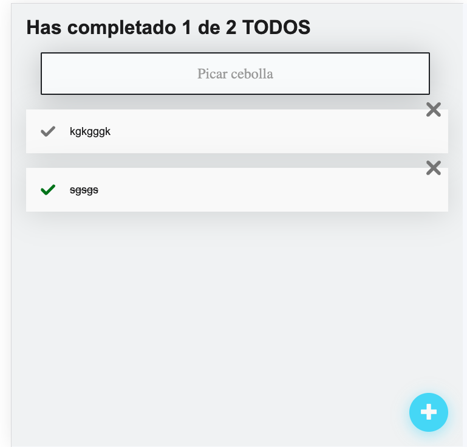

### Listado de TODOS con React.js - Versión Composición

En este repositorio encontrarás el código de la app de listado de TODOS. Para la persistencia de los datos se hace uso inicialmente de localstorage, con la idea de mejorarlo con el tiempo y hacer request hacia un servidor de nodejs para extraer información del listado de TODOS de una Base de datos Mondodb. En la rama principal podrás revisar todo el código fuente. A diferencia de la versión anterior, éste repositorio cuenta con conceptos como composición de componentes y  uso de HOC (Componentes de orden superior).

### Screenshot

#### Levantar la aplicación

Para levantar la aplicación en tu máquina localmente, sigue los siguientes pasos:

- Clonar el repositorio.

- Instalar las dependencias:

### `npm i`

- En el directorio del proyecto ejecuta:

### `npm start`

- Una vez finalizado el proceso se abrirá la vista en tu navegador con la siguiente ruta:
 [http://localhost:3000]

### Links

- Live Site URL: [Click here](https://65ca40afe5df341ccc65c0ef--animated-peony-16c8a1.netlify.app/)

### Construido con

- Semantic HTML5 markup
- CSS 
- ReactJs
- Skeleton

### Conceptos aplicados
- Composición de Componentes
- Render props
- Render functions
- HOC 

## Author

- @snatera